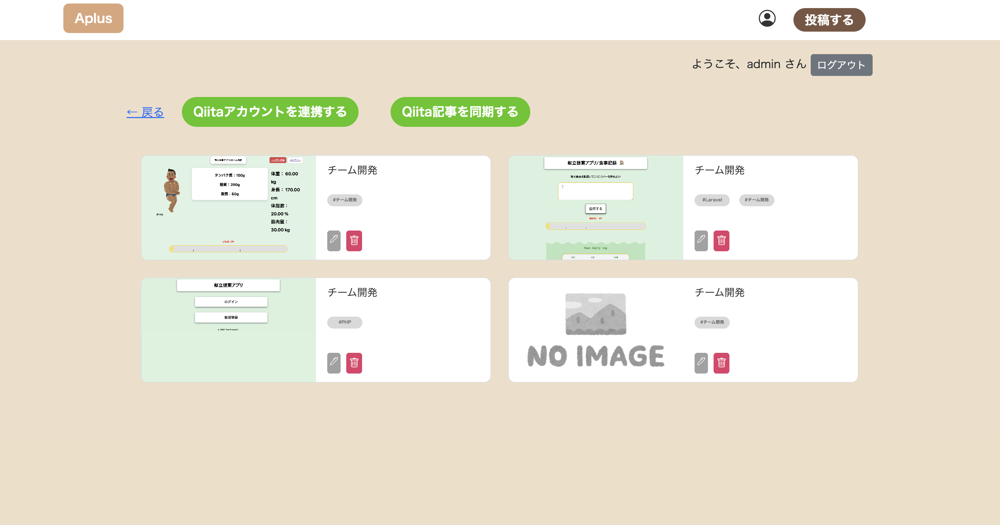

## Aplus
「Aplus」はアプレンティス生向けに作成した、チーム開発の記事を共有できるアプリです。 
過去のアプレンティス生が作成したチーム開発の記事を集約することで、 
これからチーム開発に挑戦する人が効率よく学習できる環境を提供します。 
### リンク：https://aplus-app.click

## インフラ構成図

## トップページ

## ER図

## 使用技術スタック
- PHP 8.4
- Laravel 12
- MySQL 9.3
- AWS (EC2/ALB/Route53)
- JavaScript
- HTML/CSS

## 機能・画面
### ログイン機能
- Discord IDによる認証後、任意のユーザーIDとパスワードでログイン可能です。

## 技術的に工夫したところ
ユーザーをアプレンティス生のみに絞り込むため、Discord APIを使用して登録可能なユーザーを限定しました。

## ユーザー目線で工夫したところ
記事登録の手間を減らすため、Qiita APIを用いてQiita投稿記事を自動で同期できる仕組みを実装しました。
