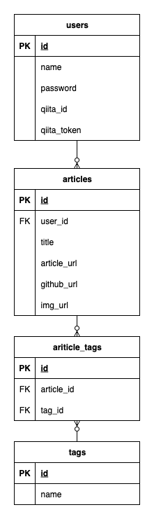

# 設計
## ワイヤーフレーム
[Figmaデザインはこちら](https://www.figma.com/design/KT9rpZ0gOiJuy6inDgt6gL/aplus?node-id=0-1&p=f&t=s7D7GFMVYrJ4DWKa-0)

## ER図

## テーブル定義
[テーブル定義はこちら](https://docs.google.com/spreadsheets/d/19_dI8WVdXTdc3-b6offRymm4amtDUa-w6IM5FDJETaE/edit?gid=0#gid=0)

## システム構成図

